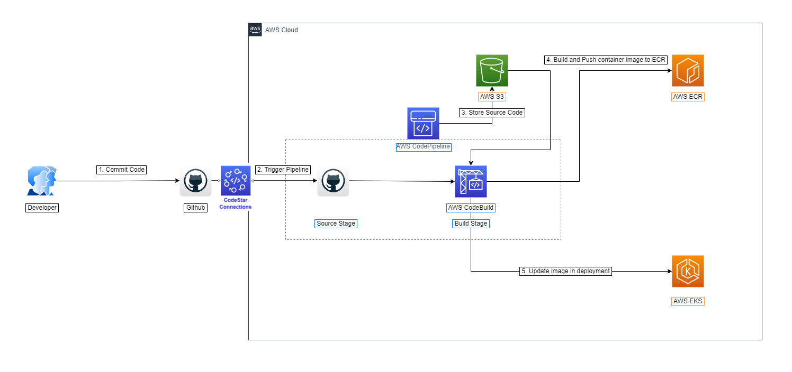

# FULL EKS CI/CD pipeline

## Architecture

## Resources
1. CodePipeline
2. 2 CodeBuild projects (1 for building docker image, 2 for deploying to EKS)
3. EKS
4. SGs
4. ECR
5. IAMs
6. S3 Artifacts buckets
7. KMS key for artificats encryption
8. Codestar connection

## Testing

`kubectl get node --kubeconfig kubeconfig_terraform-eks-dev`

k get pod -n tf-eks-staging --kubeconfig kubeconfig_terraform-eks-dev
k get svc -n tf-eks-staging --kubeconfig kubeconfig_terraform-eks-dev

 ELB

`kubectl get svc -n tf-eks-staging --kubeconfig kubeconfig_terraform-eks-dev`
